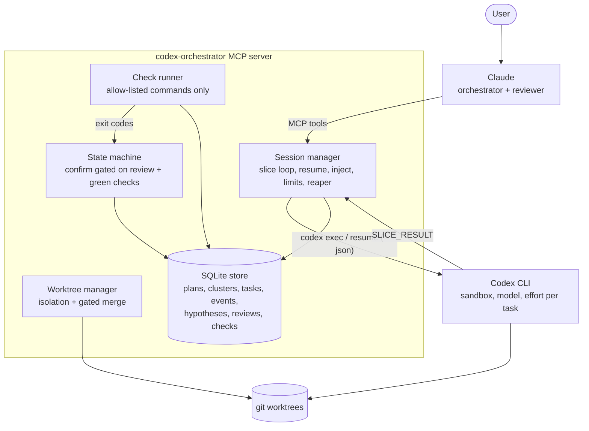
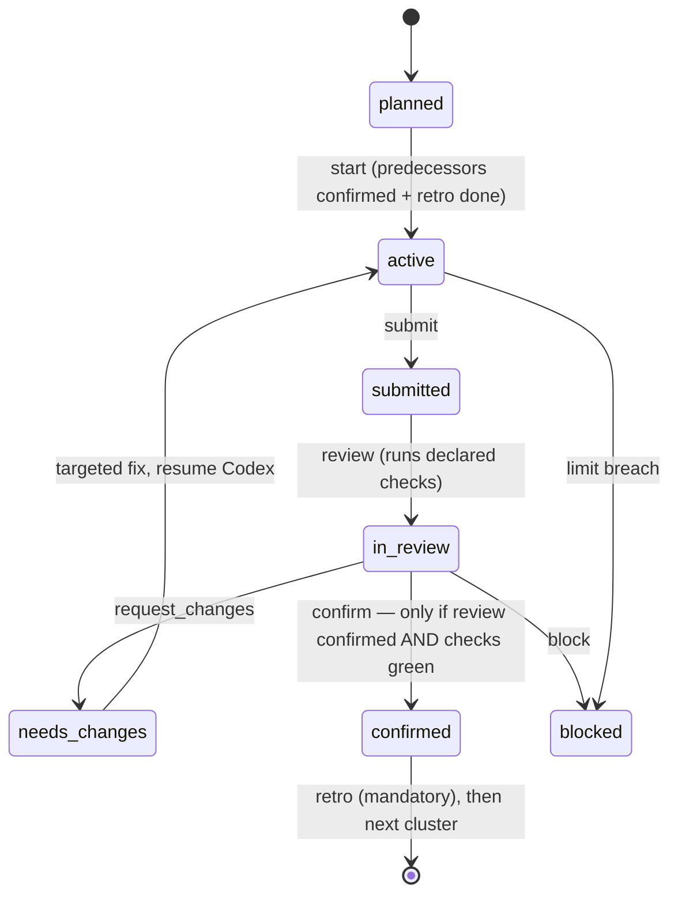

# Codex Orchestrator

**Let Claude orchestrate OpenAI Codex as a supervised implementation executor.**

An [MCP](https://modelcontextprotocol.io) server that couples Claude (architect,
orchestrator, reviewer) with the [Codex CLI](https://github.com/openai/codex)
(executor) through a *checkpoint-slice* execution model: Codex works in bounded,
resumable slices; Claude reviews every checkpoint; a server-enforced state
machine guarantees that nothing counts as done until reviews and checks are
green. All process state is persisted in SQLite — it survives context
compaction, session switches and server restarts.

[](LICENSE)


---

## Why

Letting one model both implement and judge its own work does not scale. This
server splits the roles:

- **Claude** plans, decomposes into clusters with acceptance criteria, picks
  model + reasoning effort per task, reviews results, maintains hypotheses,
  and confirms completion.
- **Codex** implements in sandboxed slices and reports in a structured
  `SLICE_RESULT` format — checkpoint, submission, or blocker (never
  improvising around missing information).
- **The server** enforces the process: `confirm` fails without a review and
  green checks, retrospectives are mandatory between clusters, limits and
  sandbox rules are fail-closed and unreachable from tool parameters.

A welcome side effect: implementation noise (file contents, diffs, test logs)
stays out of Claude's context window — typically **85–95 % fewer
Claude-side tokens** per delegated implementation task, with state kept in
SQLite and compact [TOON](https://github.com/toon-format/toon) snapshots
instead of chat history.

## How it works



The cluster lifecycle is enforced by the server — a cluster reaches `confirmed`
only with a passing review **and** green server-run checks:



Each Codex assignment runs as a sequence of bounded slices. At every slice
boundary the server parses the structured result, persists events, and applies
queued control actions (pause, cancel, injected instructions). Small tasks run
as a single synchronous slice; long tasks run in the background while Claude
polls with a long-poll `task_wait`.

## Prerequisites

- Node.js ≥ 22.5 (uses the built-in `node:sqlite`)
- [Codex CLI](https://github.com/openai/codex) installed and logged in
  (`codex login status` → *Logged in*)
- git (for worktree isolation and merge)

## Installation

### As a Claude Code plugin (recommended)

```bash
claude plugin marketplace add tomtastisch/codex-orchestrator
claude plugin install codex-orchestrator@codex-orchestrator --scope user
```

This registers the MCP server (pre-bundled, no build step) and the
`codex-orchestrator` skill, which teaches Claude the full orchestration
workflow. Start Claude in a project and invoke it with:

```text
/codex-orchestrator:codex-orchestrator Implement the requested change
```

Claude plugin skills are namespaced by design. The command therefore contains
the plugin name and the skill name. The companion status command is
`/codex-orchestrator:orchestrator-status [plan_id]`.

### As a plain MCP server

```bash
git clone https://github.com/tomtastisch/codex-orchestrator.git
cd codex-orchestrator && npm ci && npm run build
claude mcp add codex-orchestrator -- node "$PWD/dist/server.js"
```

### Per-project registration (multi-project isolation)

Register the server per project with its own store to keep concurrent
projects fully separated:

```json
{
  "mcpServers": {
    "codex-orchestrator": {
      "command": "node",
      "args": ["/path/to/codex-orchestrator/bundle/server.mjs"],
      "env": { "ORCH_HOME": "${workspaceFolder}/.orchestrator" }
    }
  }
}
```

Without `ORCH_HOME` the store defaults to `<cwd>/.orchestrator`, so separate
project directories are isolated automatically.

## Remote Codex execution and persistent authentication

Create `.orchestrator/config.json` in the project from which Claude is started:

```json
{
  "version": 1,
  "execution": {
    "mode": "remote-preferred",
    "fallback": "connectivity-only",
    "remote": {
      "id": "devbox",
      "transport": "ssh",
      "host": "devbox",
      "repository": {
        "localRoot": "/Users/me/projects",
        "remoteRoot": "/home/me/projects"
      },
      "codexBin": "codex",
      "workerRoot": "~/.cache/codex-orchestrator",
      "codexHome": "~/.codex",
      "auth": {
        "strategy": "sync-file",
        "source": "/Users/me/.codex/auth.json"
      }
    }
  }
}
```

The source must be an owner-controlled regular file with no group or world
permissions (`chmod 600 ~/.codex/auth.json`). The credential is transferred in
the validated worker protocol, written atomically to the persistent remote
`codexHome` with mode `0600`, and never included in task events or tool results.
Every slash-command preflight and task resolves `~/` against the remote user's
home, starts Codex with that exact `CODEX_HOME` and performs a fresh
`codex login status` check. If the remote file
is missing or stale, `sync-file` installs or refreshes it and then repeats the
check. This survives Claude, plugin and target restarts as long as the remote
home directory persists.

For managed environments, use a secret manager command instead of a file:

```json
"auth": {
  "strategy": "access-token",
  "secretCommand": ["security", "find-generic-password", "-s", "codex-access-token", "-w"]
}
```

The command output is passed only through stdin to `codex login
--with-access-token`; it is not stored by the orchestrator. `existing` is the
strictest strategy and fails if the remote Codex installation is not already
authenticated. Local fallback is permitted only for retryable connectivity
errors, never for authentication, host-key, protocol or repository mismatches.

## Tools

| Tool | Purpose |
|---|---|
| `task_start` | Start a Codex assignment linked to a mandatory hypothesis (slice budget, sandbox, model, effort, worktree, wait mode) |
| `orchestrator_doctor` | Verify configured targets, Codex versions and authentication; securely bootstrap remote auth |
| `task_wait` | Long-poll for new events / slice boundaries — the core orchestration primitive |
| `task_events` | Cursor-based event history, filterable by kind |
| `task_control` | `pause` \| `resume` \| `cancel` \| `inject` (delivered at the next slice boundary) |
| `task_result` | Consolidated result: diff summary, tests, recent `SLICE_RESULT`s, open items |
| `models_list` | Available models, effort ladder, routing table, escalation rule |
| `cluster_plan` | Create/update a persistent plan with gated clusters (idempotent) |
| `cluster_transition` | `start`/`submit`/`review`/`confirm`/`retro`/… — server-enforced state machine |
| `cluster_merge` | Merge a reviewed worktree branch back (conflicts abort cleanly) |
| `hypotheses` | Create and append-only update versioned, falsifiable assumptions with evidence |
| `user_decision` | Persist user decisions and standing preferences for review findings |
| `repo_check` | Run allow-listed checks (tests, lint, typecheck, diff stats) |
| `plan_snapshot` | Durable TOON/JSON snapshot of the full plan state |
| `result_artifact` | Generate a checksummed final `.toln` run artifact and summary |
| `audit_log` | Read the secret-redacted security audit trail |
| `codex_update` | Check/apply Codex CLI updates (stable or pre-release channel) |

## Example: from a goal to a confirmed change

A minimal end-to-end walkthrough of what the orchestrator actually does. Claude
drives these tool calls; the server enforces the gates.

**1. Goal → plan.** Claude turns a request ("add input validation to the signup
endpoint and cover it with tests") into a persistent, gated plan:

```jsonc
cluster_plan({
  goal: "Validate signup input and test it",
  repo_path: "/path/to/app",
  clusters: [{
    id: "C1", name: "signup-validation", goal: "Reject invalid signups + tests",
    acceptance: ["invalid email/'' password rejected with 400", "new unit tests pass"],
    model_policy: { model: "gpt-5.5", effort: "high", sandbox: "workspace-write" },
    review_strategy: { checks: ["npm_test", "typecheck"] }
  }]
})
// → { plan_id: "P_…", clusters: [{ id: "C1", status: "planned" }] }
```

**2. Start the gate, delegate to Codex.**

```jsonc
cluster_transition({ cluster_id: "C1", action: "start" })   // → status: "active"
hypotheses({
  action: "create", plan_id: "P_…", cluster_id: "C1",
  initial_assumption: "Input validation can be added without changing valid requests",
  confidence_before: 0.8,
  critical_questions: ["Which clients rely on current coercion?"],
  falsification_plan: ["Run existing compatibility tests"]
})
// → { hypothesis: { id: "H_…" } }
task_start({
  cluster_id: "C1", hypothesis_id: "H_…",
  sandbox: "workspace-write", model: "gpt-5.5", effort: "high",
  slice_budget: { max_minutes: 10 }, wait_for: "started", worktree: "auto",
  instructions: "Add validation to the signup handler; add unit tests. Report a SLICE_RESULT.",
  acceptance_criteria: ["invalid signups rejected with 400", "new tests pass"]
})
// → { task_id: "T_…", status: "running", worktree: "…/worktrees/T_…" }
```

**3. Supervise the slices.** Claude long-polls and reacts:

```jsonc
task_wait({ task_id: "T_…", cursor: 0 })
// checkpoint → optionally task_control({ action: "inject", message: "also trim whitespace" })
// submission → the SLICE_RESULT reports: tests "npm test: pass"
```

**4. Review — and the gate that makes it trustworthy.** The server independently
re-runs the declared checks; a self-reported "pass" that actually exited non-zero
is caught and the submission is refused.

```jsonc
cluster_transition({ cluster_id: "C1", action: "submit" })
cluster_transition({ cluster_id: "C1", action: "review", payload: { status: "confirmed" } })
// runs npm_test + typecheck server-side

cluster_transition({ cluster_id: "C1", action: "confirm" })
// ✗ if a check is red   → { ok: false, error: "confirm verweigert", reasons: ["Check 'npm_test' exit=1"] }
// ✓ if all green        → { ok: true, status: "confirmed" }
```

If review found problems instead: `request_changes` → a targeted correction task
resumes the same Codex session, then back to review.

**5. Confirm → retro → durable snapshot.**

```jsonc
cluster_transition({ cluster_id: "C1", action: "retro", payload: { content: "…lessons…" } })
cluster_merge({ cluster_id: "C1", task_id: "T_…" })       // merge the reviewed worktree
plan_snapshot({ plan_id: "P_…", format: "toon" })          // compact, compaction-proof state
```

The point: **"Codex says done" never ends a cluster** — only a passing review plus
green server-run checks does. Everything above is persisted, so the workflow
survives context compaction and server restarts.

## Per-task model & effort control

Every task specifies **which model** does the work and **how hard it thinks**:

```jsonc
{
  "model": "gpt-5.5",          // or "auto", validated against models_list
  "effort": "xhigh",            // low | medium | high | xhigh
  "sandbox": "read-only",       // or workspace-write
  "slice_budget": { "max_minutes": 8 }
}
```

Invalid combinations are rejected before Codex is ever started. The escalation
rule (two failed correction slices → next effort step or stronger model) is
part of the skill and the `models_list` output.

## Security model (fail-closed)

- `danger-full-access` is disabled server-side and not reachable via any tool
  parameter.
- Codex runs with `--ignore-user-config`: isolated from global plugins,
  personality and trust settings; auth still comes from `CODEX_HOME`.
- Network access for slices is **off by default**, enabled per task only.
- `repo_check` executes allow-listed argv commands only — no free-form shell
  from either model.
- Per-task `extra_config` passes through a category blocklist (`sandbox*`,
  `mcp_servers*`, `hooks*`, `shell_environment_policy*`, `danger*`, …) so it
  cannot be used for process or environment injection.
- Hard limits per task (max slices, max runtime, max diff size) → breach sets
  `blocked` and hands the decision to the orchestrator.
- The event log is append-only; every confirm references review and check IDs.

## Multi-project isolation

- One store per project (`ORCH_HOME`, default `<cwd>/.orchestrator`).
- Tasks are stamped with the owning process PID; the startup reaper only fails
  tasks of **dead** processes — a concurrently running instance of another
  project is never touched.
- A second instance on the same store logs a loud warning; SQLite runs in WAL
  mode with a busy timeout.
- Codex threads are isolated per task by design.

## Staying up to date

- **The plugin itself.** Claude's marketplace lifecycle is authoritative:
  `claude plugin marketplace update codex-orchestrator`, followed by a Claude
  restart or `/reload-plugins`. The MCP server never mutates its own installed
  bundle.
- **The Codex CLI.** `codex_update` explicitly checks/applies Codex releases
  (stable `latest` or pre-release `alpha`); no update runs implicitly at startup.

Relevant environment variables: `ORCH_HOME`, `ORCH_CONFIG_FILE`,
`ORCH_MAX_CONCURRENT`, `ORCH_SIGN_MERGE`, `ORCH_CODEX_BIN`,
`ORCH_MODEL_FAST|BALANCED|STRONG`.

## Development

```bash
npm ci
npm run build        # TypeScript → dist/
npm test             # unit tests (parser, state machine, isolation) — no API calls
npm run bundle       # single-file bundle → bundle/server.mjs
npm run verify:bundle # reproducibly rebuild and compare both release bundles
npm run benchmark    # 7 MCP starts; enforce size and p95 latency budgets
npm run test:remote  # real loopback OpenSSH, synthetic auth and fake Codex slice
npm run test:remote:real # real local Codex auth; no model turn
node scripts/modelcheck.mjs    # model/effort validation (no API)
node scripts/bundlecheck.mjs   # MCP handshake against the bundle (no API)
node scripts/e2e-mcp.mjs       # end-to-end with a real Codex slice (uses your Codex account)
node scripts/e2e-m1m3.mjs      # worktree, pause/inject/resume, merge (uses your Codex account)
```

The unit suite includes protocol and fake-SSH coverage. `npm run test:remote`
adds a real OpenSSH transport: it creates ephemeral host and user keys, deploys
the actual worker bundle, bootstraps a synthetic credential, executes one fake
Codex slice, creates a fresh target instance and confirms that authentication
still works after the local source credential has been removed. CI runs this
acceptance test on macOS.

`npm run test:remote:real` repeats the persistence check with the current local
Codex binary and private `auth.json`. It does not execute a model turn. Both
remote tests use only temporary directories, terminate their owned `sshd`
process and remove all temporary keys and credentials before exit.

The release benchmark fails when either bundle exceeds its size budget or when
the p95 MCP cold-start/Doctor latency exceeds its budget. Current limits are
1.25 MiB for `bundle/server.mjs`, 256 KiB for `bundle/worker.mjs`, 2,500 ms for
cold start and 1,500 ms for Doctor. Override only the sample count with
`ORCH_BENCHMARK_ITERATIONS=5..50`; release budgets are intentionally fixed.

## License

[MIT](LICENSE) © 2026 Tom Werner
