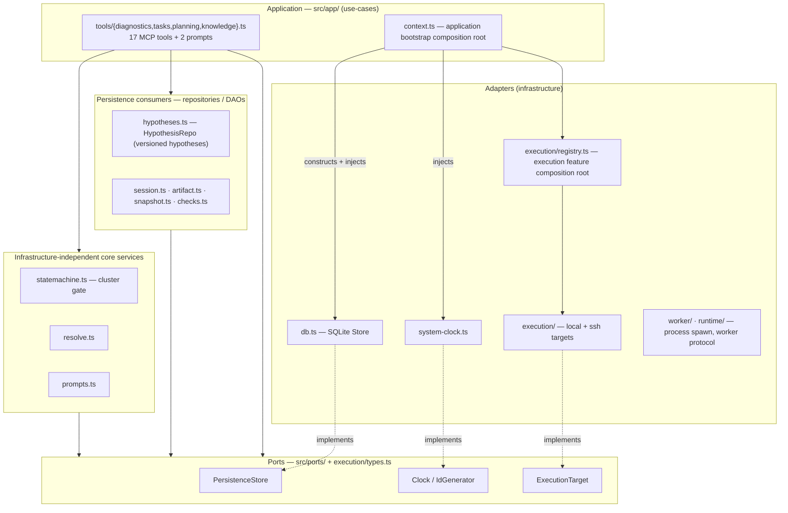
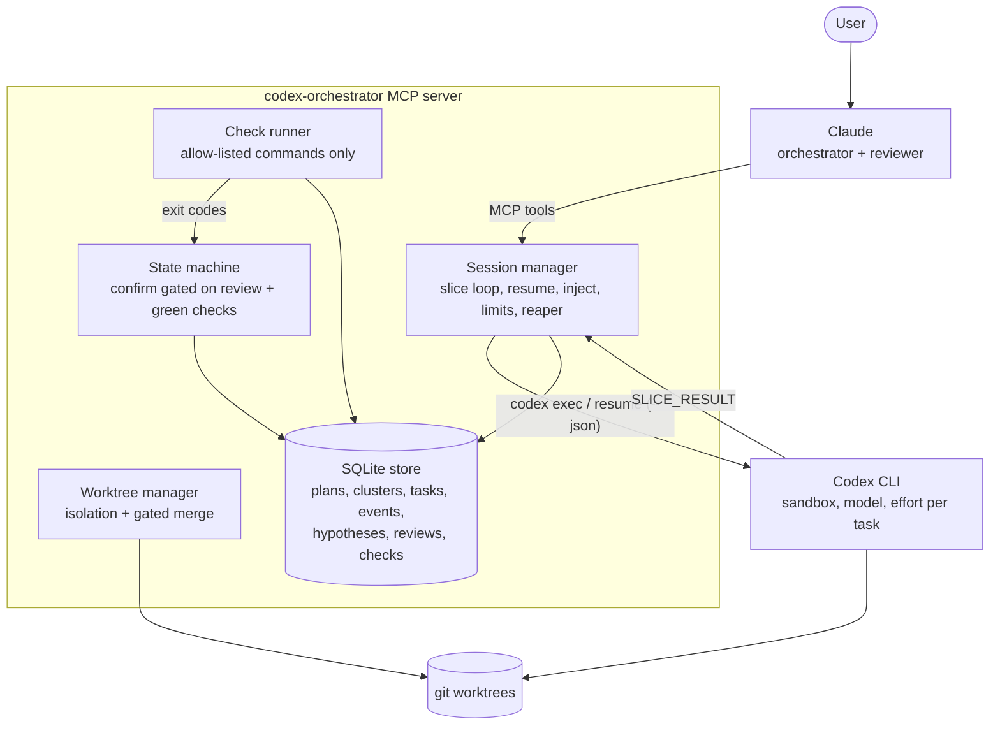
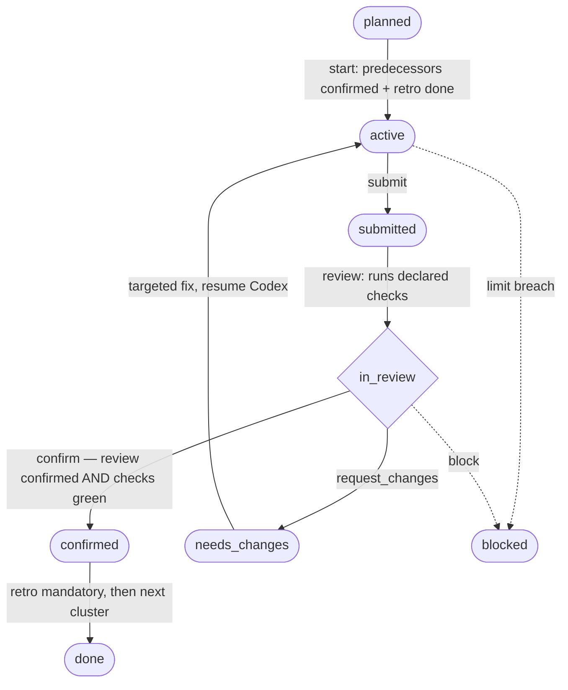

# Architecture

Codex Orchestrator applies hexagonal architecture at its established dependency
boundaries. The established ports: persistence, clock/id, execution. Claude is
the orchestrator/reviewer, the Codex CLI is the implementation executor, and a
server-enforced state machine guarantees that nothing counts as done until
reviews and checks are green. This document describes the layers, runtime flow,
and currently enforced boundaries without treating every infrastructure concern
as an interchangeable port.

- Ports & adapters detail: [`ports-and-adapters.md`](ports-and-adapters.md)
- Module/file inventory and test mapping: [`module-reference.md`](module-reference.md)
- Review/merge governance: [`review-policy.md`](review-policy.md)

## Layers

The infrastructure-independent core services use established ports instead of
concrete persistence, clock/id, or execution adapters. SQLite and configured
execution targets implement those seams. Filesystem, MCP transport, worktree,
review, updater, and other infrastructure concerns are not claimed to be ported
or interchangeable unless a code contract enforces that boundary.

For the established boundaries, dependency arrows point from consumers to
ports. `tests/architecture-boundary.test.mjs` enforces the declared persistence,
clock/id, core-consumer, and composition-root contracts;
`tests/execution-boundary.test.mjs` enforces the execution seam. A persistence
consumer that reaches for `db.js`, `node:sqlite`, or a raw `store.db` gateway
fails the build. See [`ports-and-adapters.md`](ports-and-adapters.md).

## Runtime flow

Claude drives MCP tool calls; the server enforces the gates and persists all
state in SQLite so it survives context compaction and restarts.

Each Codex assignment runs as a sequence of bounded, resumable slices. At every
slice boundary the server parses the structured `SLICE_RESULT`, persists events,
and applies queued control actions (pause, cancel, injected instructions). Small
tasks run as a single synchronous slice; long tasks run in the background while
Claude polls with a long-poll `task_wait`.

## Cluster lifecycle

A cluster reaches `confirmed` only with a passing review **and** green
server-run checks. The happy path runs down the centre; the two exceptional
transitions to `blocked` are dotted.

The invariant: **"Codex says done" never ends a cluster** — only a passing
review plus green server-run checks does. The server independently re-runs the
declared checks, so a self-reported "pass" that actually exited non-zero is
caught and the submission is refused.

## Security model (fail-closed)

- `danger-full-access` is disabled server-side and unreachable via any tool parameter.
- Codex runs with `--ignore-user-config`: isolated from global plugins, personality and trust settings; auth still comes from `CODEX_HOME`.
- Network access for slices is off by default, enabled per task only.
- `repo_check` executes allow-listed argv commands only — no free-form shell from either model.
- Per-task `extra_config` passes through a category blocklist (`sandbox*`, `mcp_servers*`, `hooks*`, `shell_environment_policy*`, `danger*`, …).
- Hard limits per task (max slices, max runtime, max diff size) → breach sets `blocked` and hands the decision to the orchestrator.
- The event log is append-only; every `confirm` references review and check IDs. The audit trail is secret-redacted (`audit_log`).

## Multi-project isolation

- One store per project (`ORCH_HOME`, default `<cwd>/.orchestrator`).
- Tasks are stamped with the owning process PID; the startup reaper only fails tasks of **dead** processes — a concurrently running instance of another project is never touched.
- A second instance on the same store logs a loud warning; SQLite runs in WAL mode with a busy timeout.
- Codex threads are isolated per task by design.

## Single source of truth

Runtime versions, coverage floors, the test schema and the architecture layer
manifest live once under `ssot/` (indexed by `ssot/index.toml`) and are bound to
every consumer by contract tests. Change a value in its owning JSON file only;
the contract test fails if any consumer drifts.
