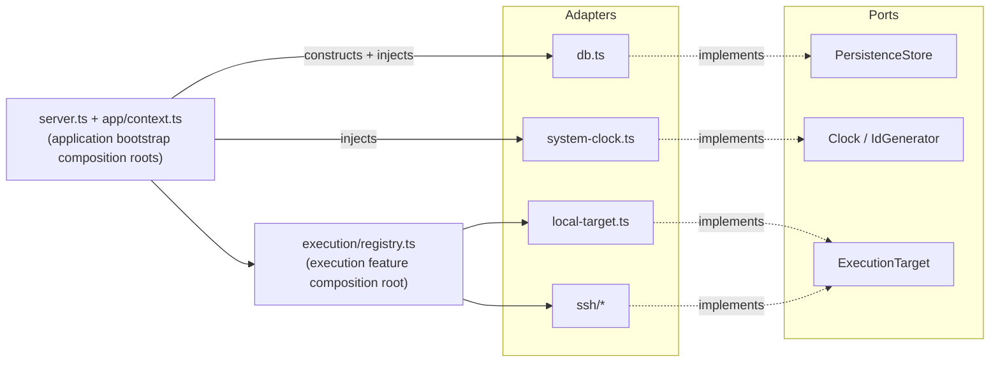

# Ports & Adapters

Codex Orchestrator has three established port groups: persistence, clock/id,
and execution. Their consumers depend on interfaces while composition code
selects concrete adapters. These enforced seams do not imply that filesystem,
MCP transport, worktree, review, updater, or every other infrastructure concern
already has an interchangeable port.

The dependency direction is enforced statically by
`tests/architecture-boundary.test.mjs` and `tests/execution-boundary.test.mjs`,
which scan every import specifier (static, side-effect, dynamic, `require`) and
fail the build on any violation. The layer membership is a single source of
truth in [`ssot/architecture.json`](../ssot/architecture.json).

## The ports

| Port | Defined in | Contract | Adapter(s) |
|---|---|---|---|
| `PersistenceStore` | `src/ports/persistence.ts` | Durable state: plans, clusters, tasks, events, hypotheses, reviews, checks, decisions, artifacts, audit — all via typed methods and row DTOs | `src/db.ts` (`Store`, SQLite via `node:sqlite`) |
| `Clock` / `IdGenerator` | `src/ports/clock.ts` | Current instant / prefix-tagged identifiers | `src/system-clock.ts` (`systemClock`, `systemIdGenerator`) |
| `ExecutionTarget` | `src/execution/types.ts` | Where a Codex slice runs: doctor, start slice, run check/git, worktree ops | `src/execution/local-target.ts`, `src/execution/ssh/*` |

### PersistenceStore

`Store` in `src/db.ts` `implements PersistenceStore`, so the compiler checks
that the adapter satisfies the contract. The port exposes no raw SQL gateway
— every query is an intention-revealing, typed method returning a concrete row
DTO (`PlanRow`, `TaskRow`, `ReviewRow`, …). The declared persistence consumers
receive the port, and the architecture contract rejects imports of the concrete
adapter and raw `store.db` access. The concrete `Store` retains its `db` handle
for adapter-level and migration tests.

### Clock / IdGenerator

Reading the wall clock or generating identifiers are ambient side effects that
make behaviour non-deterministic.
`Store`, `HypothesisRepo`, and `SessionManager` require explicit `Clock` and `IdGenerator` constructor arguments.
The application bootstrap composition root
(`src/app/context.ts`) injects the system adapters. `tests/clock-injection.test.mjs`
proves the seam by injecting a fixed clock and a counter id-generator and
asserting deterministic outputs.

### ExecutionTarget

`router.ts` selects a target through the port; `local-target.ts` and `ssh/*` are
the concrete adapters. `execution/registry.ts` is the execution feature
composition root that constructs the configured targets and router.

## Composition roots

`src/server.ts` and `src/app/context.ts` are the application bootstrap
composition roots. `server.ts` is the process entry point: it builds the
`AppContext`, registers the tool/prompt modules on the MCP server, and manages
the instance-guard/reaper/graceful-shutdown lifecycle.

`src/app/context.ts` (`createAppContext`) constructs the application graph and
the concrete persistence and clock/id dependencies. It delegates execution
target construction to `src/execution/registry.ts`, the execution feature
composition root.

## Enforced boundaries (what the tests forbid)

- No persistence consumer imports `db.js` or `node:sqlite`; they depend on `PersistenceStore`.
- The persistence port declares no `readonly db` / raw SQL gateway type.
- No consumer reaches through a raw `.db` gateway (`store.db.prepare(...)`) anywhere outside the adapter.
- Infrastructure-independent core services (`statemachine`, `prompts`) express infrastructure needs through a port and do not import the listed concrete I/O modules or adapters.
- `resolve.ts` is an application service because it combines the persistence port with concrete configuration and Git repository validation.
- The clock/id ports have real consumers (`db.ts`, `hypotheses.ts`, `session.ts`) — the guard fails if the abstraction ever rots into dead code.
- `server.ts` registers no tools directly and only wires the application layer; the tool modules never import the persistence adapter.
- `server.ts` and `app/context.ts` are the application bootstrap composition roots; `execution/registry.ts` is the execution feature composition root.

These rules do not make every tool module port-only. The planning tool currently
imports the concrete infrastructure adapter `src/worktree.ts` and the concrete
output adapters `src/snapshot.ts` and `src/artifact.ts` directly. This known,
explicitly allow-listed state is recorded in `ssot/architecture.json`; it is not
covered by the persistence, clock/id, or execution ports and must not be cited as
if those seams already abstract it.

## Follow-up boundary

Dynamic discovery, capability routing, and named module-communication contracts
are follow-up scope in [issue #38](https://github.com/tomtastisch/codex-orchestrator/issues/38).
That work includes replacing the planning tool's direct worktree, snapshot, and
artifact dependencies with appropriate named contracts. The current execution
registry is configured explicitly; this document does not present that future
module-communication design as implemented.
