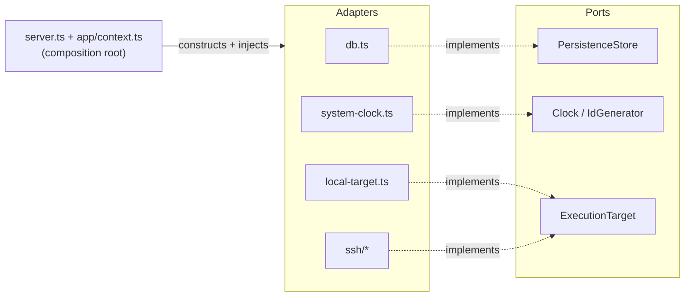

# Ports & Adapters

The core of Codex Orchestrator depends only on **ports** (interfaces). Concrete
technology sits behind them as **adapters** that are constructed and injected in
one place — the composition root. Every port is interchangeable; swapping an
adapter never touches domain or application code.

The dependency direction is enforced statically by
`tests/architecture-boundary.test.mjs` and `tests/execution-boundary.test.mjs`,
which scan every import specifier (static, side-effect, dynamic, `require`) and
fail the build on any violation. The layer membership is a single source of
truth in [`ssot/architecture.json`](../ssot/architecture.json).

## The ports

| Port | Defined in | Contract | Adapter(s) |
|---|---|---|---|
| `PersistenceStore` | `src/ports/persistence.ts` | Durable state: plans, clusters, tasks, events, hypotheses, reviews, checks, decisions, artifacts, audit — all via typed methods and row DTOs | `src/db.ts` (`Store`, SQLite via `node:sqlite`) |
| `Clock` / `IdGenerator` | `src/ports/clock.ts` | Current instant / prefix-tagged identifiers | `src/system-clock.ts` (`systemClock`, `systemIdGenerator`) |
| `ExecutionTarget` | `src/execution/types.ts` | Where a Codex slice runs: doctor, start slice, run check/git, worktree ops | `src/execution/local-target.ts`, `src/execution/ssh/*` |

### PersistenceStore

`Store` in `src/db.ts` `implements PersistenceStore`, so the compiler guarantees
the adapter satisfies the whole contract. The port exposes **no raw SQL gateway**
— every query is an intention-revealing, typed method returning a concrete row
DTO (`PlanRow`, `TaskRow`, `ReviewRow`, …). Domain and application modules can
never reach `store.db`; it is off the port and therefore compile-time
unreachable from consumers. The concrete `Store` retains its `db` handle only for
its own adapter-level and migration tests.

### Clock / IdGenerator

Reading the wall clock or generating identifiers are ambient side effects that
make behaviour non-deterministic. `Store`, `HypothesisRepo` and `SessionManager`
receive a `Clock` and an `IdGenerator` by constructor injection (defaulting to
the system adapters); the composition root (`src/app/context.ts`) is the only
wiring site. `tests/clock-injection.test.mjs` proves the seam by injecting a
fixed clock and a counter id-generator and asserting the outputs are fully
deterministic — the payoff of the inversion.

### ExecutionTarget

The one pre-existing hexagonal island. `router.ts` selects a target purely
through the port; `local-target.ts` and `ssh/*` are adapters that never
cross-import each other; `registry.ts` is the composition root that wires the
concrete targets. This is the reference pattern the rest of the codebase now
follows.

## The composition root

`src/server.ts` is a thin (~70-line) process entry point that contains no
business logic: it builds the `AppContext`, registers the tool/prompt modules on
the MCP server, and manages the instance-guard/reaper/graceful-shutdown
lifecycle.

`src/app/context.ts` (`createAppContext`) is the single place that constructs the
concrete adapters (`Store`, execution runtime, `SessionManager`,
`HypothesisRepo`, `WorktreeManager`) and the response helpers, and injects the
`Clock`/`IdGenerator` ports.

## Enforced boundaries (what the tests forbid)

- No persistence consumer imports `db.js` or `node:sqlite`; they depend on `PersistenceStore`.
- The persistence port declares no `readonly db` / raw SQL gateway type.
- No consumer reaches through a raw `.db` gateway (`store.db.prepare(...)`) anywhere outside the adapter.
- Domain-pure modules (`statemachine`, `prompts`, `resolve`) import no I/O at all — not `fs`, `child_process`, `node:sqlite`, `db.js`, nor `system-clock`.
- The clock/id ports have real consumers (`db.ts`, `hypotheses.ts`, `session.ts`) — the guard fails if the abstraction ever rots into dead code.
- `server.ts` registers no tools directly and only wires the application layer; the tool modules never import the persistence adapter.
- Only the composition roots (`server.ts`, `app/context.ts`) construct concrete adapters.
