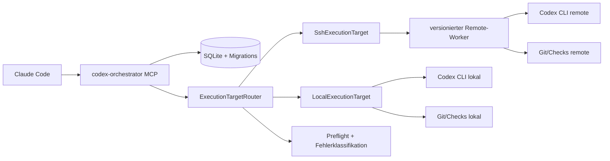
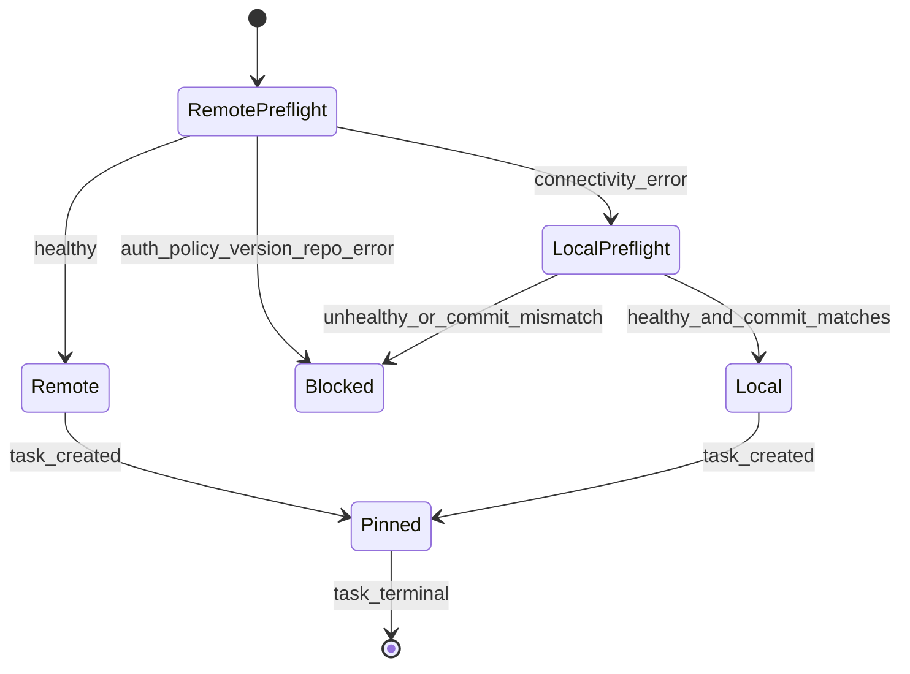

# Remote Execution und Produktionsreife: Design

Status: entscheidungsreif
Basis: `main` auf Commit `9bc76f7`
Datum: 2026-07-05

## 1. Ziel

`codex-orchestrator` wird zu einem produktionsreifen Claude-Code-Plugin, das
OpenAI Codex weiterhin als beaufsichtigten Executor verwendet und optional auf
einem vertrauenswürdigen SSH-Ziel ausführt. Der Orchestrator bevorzugt das
konfigurierte Remote-Ziel, fällt aber ausschließlich vor Beginn eines neuen
Slices und nur bei eindeutig klassifizierten Verbindungsfehlern auf das lokale
Ziel zurück.

Das Plugin bleibt mit der bestehenden lokalen Installation kompatibel. Eine
Remote-Konfiguration ist opt-in. Bestehende Nutzer erhalten nach dem Update
weiterhin lokale Ausführung, bis sie ein Remote-Ziel konfigurieren.

## 2. Verbindliche Grenzen

- Das Produkt ist ein Claude-Code-Plugin. Maßgeblich sind
  `.claude-plugin/plugin.json`, `.claude-plugin/marketplace.json`, der
  eingebettete MCP-Server und `skills/codex-orchestrator/SKILL.md`.
- Der bevorzugte Claude-Slash-Command ist der vorhandene Skill im aktuellen
  `skills/<name>/SKILL.md`-Format. Nutzer starten ihn als
  `/codex-orchestrator [Auftrag]`; ein redundanter legacy-Command unter
  `commands/` wird nicht eingeführt.
- Codex ist der ausführende Prozess. Das Projekt wird nicht als Codex-Plugin
  umgebaut.
- Anmeldedaten werden nie geparst, protokolliert, in Tool-Antworten ausgegeben
  oder in Git geschrieben.
- Eine vorhandene ChatGPT-Anmeldung darf gemäß offizieller Codex-Dokumentation
  durch eine unveränderte, binäre Übertragung von `auth.json` auf einen
  vertrauenswürdigen Headless-Host initialisiert werden. Die Datei wird wie ein
  Passwort behandelt. Referenz: https://developers.openai.com/codex/auth
- Der sichere Standard bleibt `existing`: Das Remote-Ziel muss bereits
  angemeldet sein. `sync-file` ist eine explizit aktivierte Bootstrap-Option.
- Ein OS-Keyring wird nicht ausgelesen. Fehlt eine dateibasierte
  `auth.json`, wird Device-Auth oder ein Codex Access Token empfohlen.
- Ein ChatGPT/Codex Access Token ist nur für Business-/Enterprise-Workspaces
  ein planbarer Automationsweg. API-Key-Authentifizierung ist nicht identisch
  mit dem ChatGPT-Nutzerkonto und wird nicht als Ersatz ausgegeben.
- Ein laufender oder fortzusetzender Slice wechselt niemals das Target.
- SSH-Ziele folgen denselben Vertrauens- und Least-Privilege-Anforderungen wie
  offizielle Codex-Remote-Verbindungen. Referenz:
  https://developers.openai.com/codex/remote-connections
- Ein Remote-Repository und ein lokales Fallback-Repository müssen denselben
  aufgezeichneten Git-Commit repräsentieren. Bei uncommittierten Änderungen ist
  automatischer Target-Wechsel gesperrt.
- GitHub-Connector-Drosselung ist kein Codex-Authentifizierungsfehler. Das
  Plugin kann den Claude-seitigen GitHub-Connector nicht reparieren. Es muss
  beide Fehlerklassen getrennt diagnostizieren.
- Die Aufnahme in einen offiziellen Claude-Plugin-Marketplace ist ein externer
  Veröffentlichungsprozess. Das Repository kann vollständig
  einreichungsfertig gemacht werden; die Annahme durch den Marketplace kann
  nicht durch Code garantiert werden.

## 3. Verifizierter IST-Zustand

### 3.1 Repository und Distribution

- `package.json` und `.claude-plugin/plugin.json` deklarieren Version `1.1.0`.
- `package-lock.json` deklariert noch Version `1.0.0`.
- Der MCP-Handshake meldet hartkodiert Version `0.3.0`.
- Das aktuelle Git-Tag ist `v1.1.0`; `claude plugin tag --dry-run .` erwartet
  dagegen `codex-orchestrator--v1.1.0`.
- `claude plugin validate .` besteht mit einer Warnung.
- `claude plugin validate --strict .` scheitert, weil die Marketplace-Wurzel
  keine `description` enthält.
- Das eingecheckte `bundle/server.mjs` entspricht bytegenau einem frischen
  Build aus dem aktuellen Quellcode.
- `npm pack --dry-run` meldet die fehlende `.npmignore` und würde Quellcode,
  Tests, CI-Dateien und lokale Buildprodukte in das npm-Paket aufnehmen.
- `SECURITY.md`, `CONTRIBUTING.md`, `CHANGELOG.md`, `.node-version` und eine
  dokumentierte Release-Policy fehlen.

### 3.2 Laufzeit

- `src/codex.ts` startet ausschließlich `config.codexBin` lokal.
- Der Kindprozess erbt das vollständige `process.env` des MCP-Servers.
- Es existieren keine Target-Abstraktion, kein Remote-Transport, kein
  Preflight und kein Doctor-Tool.
- `models_list` verwendet eine statische Tabelle, obwohl die installierte CLI
  den lokalen Katalog mit `codex debug models --bundled` liefern kann.
- `src/server.ts` enthält 647 Zeilen und registriert sämtliche Tools,
  Lifecycle-Logik und Updatepfade in einem Modul.
- `src/session.ts` enthält 518 Zeilen und verbindet Scheduling,
  Prozesssteuerung, Event-Persistenz, Ergebnisprüfung und Target-unabhängige
  Zustandslogik.

### 3.3 Authentifizierung

- Die lokale CLI ist mit ChatGPT angemeldet.
- `codex login --help` bietet `--with-api-key`, `--with-access-token` und
  `--device-auth`, aber keinen Befehl zum Export einer laufenden Sitzung.
- Eine dateibasierte `~/.codex/auth.json` existiert lokal mit Modus `0600`.
- Die offizielle Codex-Dokumentation erlaubt für Headless-Ziele das Kopieren
  dieser Datei über SSH oder in einen Container. Sie verlangt ausdrücklich,
  die Datei wie ein Passwort zu behandeln.
- Die Dokumentation empfiehlt Device-Auth für Headless-Systeme und API-Keys
  als Standard für allgemeine Automation. Für eine identische
  ChatGPT-Workspace-Identität sind Codex Access Tokens oder die gesicherte
  Auth-Cache-Übertragung die passenden Wege.

### 3.4 Tests und Qualität

- `npm run typecheck` besteht.
- `npm test` besteht mit 29 Tests.
- Die Gesamtabdeckung des vorhandenen kompilierten Codes beträgt 56,48 Prozent
  Zeilen und 57,14 Prozent Funktionen.
- `src/session.ts` liegt bei 18,29 Prozent Zeilenabdeckung.
- `src/codex.ts` liegt bei 40,57 Prozent Zeilenabdeckung; der reale
  Kindprozess-Lifecycle ist weitgehend ungetestet.
- Die Tests importieren `dist/*.js`. `npm test` baut `dist` nicht selbst und
  kann daher lokal gegen veraltete Artefakte laufen.
- Es gibt kein Lint-Skript, obwohl `repo_check` den Check `lint` anbietet.
- Der Offline-Audit des vorhandenen Lockfiles meldet keine bekannte
  Schwachstelle. Das ist kein aktueller Online-Advisory-Nachweis.

## 4. Sicherheits- und Korrektheitsbefunde

### P0: Vollständige Umgebungsvererbung an Repository-Code

`src/codex.ts` und `src/checks.ts` starten Kindprozesse mit `env: process.env`.
Damit können Codex-Kommandos, Tests, Buildskripte und Dependency-Hooks auf alle
Secrets des MCP-Prozesses zugreifen. Das widerspricht dem dokumentierten
Fail-closed-Modell.

Entscheidung: Kindprozesse erhalten eine zentral erzeugte, minimale
Allowlist-Umgebung. Secret-Variablen werden nur dem engsten Auth- oder
Codex-Prozess zugeordnet und niemals Repository-Checks vererbt.

### P0: Merge-Gate ist schwächer als README und Zustandsmodell

`cluster_merge` prüft nur, ob irgendein Review existiert. Ein Review mit
`needs_changes` genügt; Clusterstatus `confirmed`, grüne Checks und die
Zugehörigkeit des Tasks zum Cluster werden nicht verlangt.

Entscheidung: Merge erfordert Clusterstatus `confirmed`, letztes Review
`confirmed`, aktuelle grüne deklarierte Checks, terminalen Taskstatus und
`task.cluster_id === cluster_id`.

### P0: Read-only-Slice verändert das Zielrepository

`ensureAgentsMd()` erstellt oder erweitert vor dem ersten Slice eine
`AGENTS.md`, unabhängig vom Sandbox-Modus. Dadurch kann ein read-only-Slice den
Arbeitsbaum verändern und bestehende Projektinstruktionen dauerhaft ergänzen.

Entscheidung: Executor-Instruktionen werden ausschließlich in den Prompt
injiziert. Projektdateien werden nicht automatisch verändert. Eine optionale
Dateierzeugung wäre ein separater, expliziter Tool-Aufruf und gehört nicht zum
Task-Start.

### P0: Blocklist wird als fail-closed bezeichnet

`extra_config` verwendet eine Blocklist. Neue Codex-Konfigurationsschlüssel
können sicherheitsrelevant werden, ohne von dieser Version blockiert zu sein.

Entscheidung: Nur eine kleine Allowlist dokumentierter, nicht ausführender
Darstellungsparameter wird akzeptiert. Unbekannte Schlüssel werden abgelehnt,
nicht stillschweigend übernommen.

### P1: Prozessbeendigung eskaliert möglicherweise nicht

Nach `SIGTERM` prüft der Code `child.killed`. Diese Eigenschaft zeigt an, dass
ein Signal gesendet wurde, nicht dass der Prozess beendet ist. Ein Prozess,
der `SIGTERM` ignoriert, erhält daher möglicherweise kein `SIGKILL`.

Entscheidung: Eskalation prüft `exitCode === null && signalCode === null` und
verwendet einen gemeinsam getesteten Prozess-Lifecycle.

### P1: Unbegrenzter stdout-Speicher und persistierte sensible Ausgaben

Alle Codex-JSONL-Zeilen werden für einen Slice im Speicher gehalten. Befehls-
und Agentenausgaben werden teilweise dauerhaft in SQLite gespeichert. Eine
Redaktion oder Retention-Policy fehlt.

Entscheidung: inkrementeller Parser, harte Byte-/Zeilengrenzen, zentrale
Redaktion und konfigurierbare Aufbewahrung. Secret-Muster werden vor
Persistenz und Tool-Antwort entfernt.

### P1: Automatische Selbstaktualisierung erweitert die Lieferkette

Der Server prüft beim Start GitHub und npm und kann globale npm-Pakete sowie
einen Git-Checkout selbst aktualisieren. Für ein verwaltetes offizielles
Claude-Plugin ist der Marketplace der Update-Owner.

Entscheidung: Startup-Auto-Updates werden entfernt. Diagnose darf Versionen
anzeigen. Änderungen erfolgen nur durch den Claude-Plugin-Manager oder einen
expliziten, außerhalb laufender Tasks bestätigten Administratorprozess.

### P1: Persistenz ohne Migration und Target-Provenienz

Das SQLite-Schema wird nur mit `CREATE TABLE IF NOT EXISTS` verwaltet. Eine
Schema-Version und Migrationen fehlen. Tasks speichern nicht, auf welchem
Execution-Target sie liefen.

Entscheidung: `PRAGMA user_version`, transaktionale Migrationen und
unveränderliche Target-/Repository-Fingerprints pro Task.

### P1: Falsche Zusammenführung externer Fehlerklassen

Der zitierte Ablauf enthält sowohl GitHub-MCP-Drosselung als auch fehlende
Codex-Authentifizierung in einem Remote-Container. Diese Fehler haben keine
gemeinsame technische Ursache.

Entscheidung: Doctor und Skill unterscheiden `connector_external`,
`target_connectivity`, `codex_missing`, `codex_auth`, `policy`,
`repository_mismatch` und `protocol`.

### P2: Konfiguration und Modelle sind nicht vollständig validiert

Numerische Umgebungsvariablen können `NaN`, null oder negative Werte ergeben.
Modellnamen und Effort-Matrizen sind statisch und können gegenüber der
installierten CLI driften.

Entscheidung: Zod-validierte Konfiguration und dynamischer, gebündelter
CLI-Modellkatalog mit explizitem Fallback auf dokumentierte Defaults.

### P2: Release-Metadaten und Governance sind inkonsistent

Vier Versionsebenen sind nicht synchron, strikte Plugin-Validierung scheitert,
Actions sind nur per Major-Tag referenziert und Veröffentlichungsdokumente
fehlen.

Entscheidung: eine Versionquelle, deterministischer Release-Check, SHA-gepinnte
Actions, minimale Workflow-Berechtigungen und Marketplace-konforme Tags.

## 5. Bewertete Architekturansätze

### Ansatz A: Nur Credential-Datei kopieren

Der bestehende lokale Prozessstarter bleibt unverändert; Dokumentation oder ein
Tool kopiert lediglich `auth.json` in eine entfernte Umgebung.

Vorteile: kleinster Änderungsumfang, von der Codex-Dokumentation gedeckter
Bootstrap.

Nachteile: keine Remote-Ausführung, kein lokaler Fallback, keine Target-
Provenienz, keine sichere Fehlerklassifikation. Er erfüllt nur den
Authentifizierungsteil.

Bewertung: abgelehnt.

### Ansatz B: Target-Abstraktion mit SSH-Worker

Der lokale MCP-Server besitzt weiterhin SQLite, Zustandsmaschine und
Orchestrierungslogik. Alle targetabhängigen Operationen laufen über eine
`ExecutionTarget`-Schnittstelle. Ein kleiner, versionierter SSH-Worker führt nur
ein festes, Zod-validiertes Protokoll aus. Tasks werden beim Start an ein Target
gebunden. Remote wird bevorzugt; lokaler Fallback ist vor Slice-Start möglich.

Vorteile: konsistenter Zustand, vollständige Auditierbarkeit, kontrollierte
Remote-Operationen, testbarer Fallback, keine allgemeine Remote-Shell-API.

Nachteile: höherer Implementierungsaufwand; Repository-Mapping und Worker-
Deployment müssen sauber gelöst werden.

Bewertung: ausgewählt.

### Ansatz C: Permanenter Remote-Dienst mit mTLS

Ein eigener Agent läuft dauerhaft auf Remote-Hosts und bietet ein mTLS-
gesichertes RPC-Protokoll.

Vorteile: beste Skalierung und zentrale Flottenverwaltung.

Nachteile: zusätzlicher Dienst, Zertifikatslebenszyklus, Ports, Daemon-
Installation und erheblich größere Angriffsfläche. Für die aktuelle
Einzelhost-/Plugin-Zielsetzung unnötig.

Bewertung: für eine spätere Enterprise-Ausbaustufe zurückgestellt.

## 6. Zielarchitektur



### 6.1 ExecutionTarget

Die Schnittstelle kapselt sämtliche Operationen, die vom Ausführungsort
abhängen:

```ts
/** @typedef ExecutionTarget */
export interface ExecutionTarget {
    readonly id: string;
    readonly kind: "local" | "ssh";
    doctor(request: DoctorRequest): Promise<TargetHealth>;
    resolveRepository(mapping: RepositoryMapping): Promise<RepositoryIdentity>;
    startCodex(request: CodexRunRequest): RunningCommand;
    runCheck(request: CheckRequest): Promise<CommandResult>;
    runGit(request: GitRequest): Promise<CommandResult>;
    deployWorker?(): Promise<WorkerDeployment>;
    bootstrapAuth?(request: AuthBootstrapRequest): Promise<AuthBootstrapResult>;
}
```

Es gibt keine Methode für beliebige Shellstrings. Alle Requests sind
diskriminierte Unions mit vollständiger Laufzeitvalidierung.

### 6.2 Remote-Worker

Der Worker wird aus demselben Commit deterministisch gebaut und unter einem
contentadressierten Pfad auf dem SSH-Host installiert. Die SSH-Verbindung
startet nur den festen Worker-Einstiegspunkt. Requests und Events laufen als
längenbegrenzte JSONL-Frames über stdin/stdout.

Erlaubte Operationen:

- `handshake`
- `doctor`
- `codex.run`
- `check.run`
- `git.identity`
- `git.diff`
- `git.worktree.create`
- `git.worktree.merge`
- `git.worktree.remove`
- `auth.status`
- `auth.bootstrap`

Der Worker akzeptiert keine frei wählbaren Binärdateien, keine Shellstrings und
keine Pfade außerhalb der konfigurierten Repository-Wurzeln.

### 6.3 Authentifizierungsstrategien

`existing`:

Das Remote-Ziel muss `codex login status` erfolgreich ausführen. Dies ist der
sicherste allgemeine Standard.

`sync-file`:

Nur bei expliziter Konfiguration. Der lokale Auth-Cache muss reguläre Datei,
Eigentum des aktuellen Nutzers, Modus `0600`, kleiner als 64 KiB und außerhalb
des Repositories sein. Die Bytes werden unverändert über den bereits
hostkey-verifizierten SSH-Kanal an den Worker gestreamt. Der Worker schreibt in
eine Datei mit `0600`, führt `fsync` aus und benennt atomar um. Tool-Antworten
enthalten nur Status und Ziel, niemals Inhalt, Hash oder Token-Metadaten.

`access-token`:

Für Business-/Enterprise-Automation. Der Token wird vom Secret Manager an den
einzelnen Bootstrap-Prozess geliefert und über stdin an
`codex login --with-access-token` übergeben. Er erscheint nicht in argv,
Umgebung des Repository-Codes, Logs oder SQLite.

`device-auth`:

Interaktiver Ausnahmeweg. Er ist erforderlich, wenn weder vorhandene Remote-
Credentials noch eine sichere dateibasierte Quelle oder ein zulässiger Access
Token existieren. Die einmalige Nutzerinteraktion ist Teil des OAuth-
Sicherheitsmodells und wird nicht automatisiert umgangen.

### 6.4 Target-Routing und Fallback



`remote-preferred` ist nur aktiv, wenn ein Remote-Target vollständig
konfiguriert ist. Ohne Konfiguration bleibt `local-only` der kompatible
Standard.

Retrybare Fallback-Ursachen:

- DNS-/Hostauflösung fehlgeschlagen
- TCP/SSH-Verbindungs-Timeout
- Verbindung vor Worker-Handshake geschlossen
- explizit als temporär klassifizierter SSH-Transportfehler

Nicht retrybare und nicht fallbackfähige Ursachen:

- Host-Key-Abweichung
- Remote-Authentifizierung fehlgeschlagen
- Codex nicht installiert oder nicht angemeldet
- Worker-/Protokollversion inkompatibel
- Policy- oder Sandbox-Abweichung
- Repository-Pfad oder Git-Commit weicht ab
- aktiver oder fortzusetzender Remote-Slice

### 6.5 Persistenz

Tasks speichern mindestens:

- `target_id`
- `target_kind`
- `repository_root`
- `repository_commit`
- `worker_version`
- `routing_reason`
- `fallback_from`

Schemaänderungen laufen über transaktionale, idempotente Migrationen mit
`PRAGMA user_version`. Bestehende lokale Tasks werden auf `target_id=local`
migriert.

### 6.6 Doctor

`orchestrator_doctor` ist rein diagnostisch und redigiert. Es prüft:

- Plugin-, Bundle-, Node- und Schema-Version
- Konfigurationsvalidität
- lokale Codex-Installation und `codex login status`
- redigierte Codex-Diagnose über `codex doctor --json`
- dynamischen Modellkatalog über `codex debug models --bundled`
- SSH-Auflösung, Host-Key-Verifikation und Worker-Handshake
- Remote-Codex- und Remote-Auth-Status
- Repository-Mapping und Commit-Identität
- Fallback-Eignung
- Store-Berechtigungen und aktive Tasks

Der Doctor meldet GitHub-MCP-Probleme als `external/not-observable`; er startet
keine GitHub-Abfragen und behauptet keine Heilung des Connectors.

## 7. Konfiguration

Nicht geheime Konfiguration liegt standardmäßig unter
`.orchestrator/config.json` und wird durch Zod vollständig validiert. Die Datei
ist bereits durch den bestehenden `.gitignore`-Eintrag für `.orchestrator/`
ausgeschlossen.

```json
{
  "version": 1,
  "execution": {
    "mode": "remote-preferred",
    "fallback": "connectivity-only",
    "remote": {
      "id": "devbox",
      "transport": "ssh",
      "host": "devbox",
      "repository": {
        "localRoot": "/Users/example/project",
        "remoteRoot": "/srv/project"
      },
      "codexBin": "codex",
      "workerRoot": "~/.cache/codex-orchestrator",
      "auth": {
        "strategy": "existing"
      }
    }
  }
}
```

Secrets und Tokenwerte sind in diesem Schema ausdrücklich verboten.

## 8. Fehlerbehandlung und Observability

Alle targetbezogenen Fehler verwenden stabile Codes:

```ts
export type TargetErrorCode =
    | "TARGET_CONNECTIVITY"
    | "TARGET_HOST_KEY"
    | "TARGET_AUTH"
    | "TARGET_POLICY"
    | "TARGET_VERSION"
    | "TARGET_PROTOCOL"
    | "TARGET_REPOSITORY"
    | "TARGET_CANCELLED"
    | "TARGET_TIMEOUT";
```

Events speichern Code, Target-ID, Versuch, Dauer und redigierte Kurzmeldung.
Rohes stderr, Tokens und vollständige Kommandausgaben werden nicht dauerhaft
gespeichert.

## 9. Teststrategie

- Unit-Tests für jedes Zod-Schema und jede Fehlerklassifikation.
- Prozess-Lifecycle-Tests mit Kindprozessen, die `SIGTERM` respektieren oder
  ignorieren.
- Environment-Tests, die sicherstellen, dass Canary-Secrets weder Codex noch
  Repository-Checks erreichen.
- Auth-Tests mit synthetischen Bytefolgen; niemals reale Credentials.
- SSH-Tests gegen einen Fake-SSH-Prozess und Protokoll-Fixtures.
- Integrationstest mit lokal gestarteter Worker-Instanz ohne Netzwerk.
- E2E-Test gegen einen explizit konfigurierten privaten SSH-Testhost, nicht in
  Pull Requests aus Forks.
- Migrations-Tests von Schema v1 auf die neue Version.
- Merge-Gate-Regressionstests.
- Plugin-Strict-Validation, deterministischer Bundle-Check, Lint, Typecheck,
  Tests und Coverage-Gates in CI.
- Release-Smoke-Test aus einem gepackten Plugin-Verzeichnis, nicht aus dem
  Entwickler-Checkout.

Mindestgates vor Veröffentlichung:

- 100 Prozent Abdeckung der Security- und Routing-Entscheidungszweige
- mindestens 85 Prozent Zeilen und 80 Prozent Branches global
- keine `any` in Runtime-Code ohne dokumentierte, lokal eingegrenzte Begründung
- `claude plugin validate --strict .` erfolgreich
- Bundle reproduzierbar und sauberer Git-Diff nach Build
- keine Secret-Canaries in Logs, SQLite oder Tool-Antworten

## 10. Veröffentlichungsmodell

- Der Claude-Plugin-Manager ist alleiniger Owner für Plugin-Updates.
- Versionen in `package.json`, `package-lock.json`, Plugin- und Marketplace-
  Manifest werden in CI verglichen.
- Tags folgen `codex-orchestrator--v<version>`.
- GitHub Actions werden auf vollständige Commit-SHAs gepinnt und erhalten
  minimale `permissions`.
- Releases enthalten Checksummen, SBOM, Buildprovenienz und das geprüfte Bundle.
- Ein offizieller Marketplace-Antrag referenziert eine feste Release-Version,
  Sicherheitsdokumentation, Supportpfad und reproduzierbare Testnachweise.

## 11. Akzeptanzkriterien

1. Eine unveränderte lokale Installation arbeitet nach dem Update weiter lokal.
2. Bei gültiger SSH-Konfiguration startet ein neuer Slice remote und speichert
   Target- sowie Repository-Provenienz.
3. Bei einem simulierten SSH-Timeout startet ein neuer Slice lokal, wenn der
   lokale Commit exakt passt.
4. Bei Remote-Auth-, Host-Key-, Policy-, Protokoll- oder Commitfehlern erfolgt
   kein lokaler Fallback.
5. Ein laufender oder fortzusetzender Remote-Slice wechselt nie das Target.
6. `sync-file` überträgt eine synthetische Auth-Datei bytegenau, atomar und mit
   Modus `0600`; kein Byte erscheint in Logs, Events oder Antworten.
7. Keyring-Credentials werden nicht extrahiert.
8. Repository-Checks erhalten keine MCP-/Auth-Secrets.
9. Read-only-Slices verändern keine Repository-Datei.
10. Merge ist nur nach bestätigtem Review und grünen Checks möglich.
11. Doctor unterscheidet Remote-Verbindung, Codex-Auth und externe Connectoren.
12. Plugin-, Paket-, Bundle- und Tag-Versionen sind konsistent.
13. Strikte Claude-Plugin-Validierung und alle CI-Gates bestehen.
14. README, Skill, Security- und Betriebsdokumentation beschreiben dasselbe
    Verhalten wie der Code.
15. Nach Installation des Claude-Plugins ist `/codex-orchestrator [Auftrag]`
    in Claude sichtbar, übernimmt `$ARGUMENTS` und beginnt mit dem redigierten
    Doctor-Preflight.

## 12. Nicht enthalten

- Automatisches Umgehen von OAuth, MFA, SSO oder Workspace-Policies
- Auslesen eines OS-Keyrings
- Öffentlicher Remote-Daemon oder frei erreichbarer TCP-Port
- Beliebige Remote-Shell-Kommandos als MCP-Tool
- Mid-Slice-Failover oder Migration einer Codex-Session zwischen Hosts
- Reparatur des Claude-seitigen GitHub-MCP-Connectors
- Automatische Annahme in einem extern betriebenen offiziellen Marketplace
